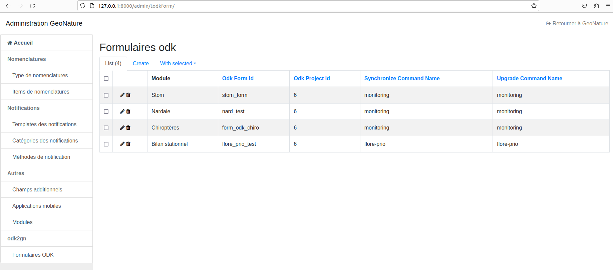

# ODK2GN pour le sous-module Flore prioritaire de GeoNature

Ce repo contient le code d'une extension pour le module GeoNature ODK2GN, se trouvant à l'URL suivant: https://github.com/PnX-SI/odk2gn

Il permet d'avoir toutes les fonctionnalités d'ODK2GN pour ce sous-module spécifique.

## Installation

Ce repo est une extension, il faut d'abord installer le module GeoNature ODK2GN (URL: https://github.com/PnX-SI/odk2gn), et le module gn_module_flore_prioritaire (URL: https://github.com/PnX-SI/gn_module_flore_prioritaire).

Comme ODK2GN, ce sous-module s'installe dans l'environnement virtuel de GeoNature. Lancer les commandes suivantes:

```sh
# Activation du virtual env de GeoNature
source <path_vers_gn>/backend/venv/bin/activate
# Installation 
pip install -e . -r requirements.txt
```
## Configuration : 

Toute la config à faire est déjà faite pour le module ODK2GN, rien à faire spécifiquement ici.

## Exemple de formulaire : 

La première version du formulaire ODK utilisé est désormais présent dans le repo. Il est prêt à être téléversé sur ODK Central.

## Mise en place de la synchronisation automatique des formulaires

Comme pour un formulaire de module Monitoring, il faut lancer GeoNature, aller dans les menus "Admin" puis "BackOffice Geonature", et ensuite dans le menu "Formulaires ODK". Puis, cliquer sur le menu "Create". Choisir le module "Bilan stationnel", et remplir ainsi le menu : 

- La colonne "ODK Form Id" avec le form_id de la page "Settings" du fichier xlsx téléversé sur ODK Central
- La colonne "ODK Form Id" avec l'id du projet dans ODK Central où se trouve ce formulaire
- Les colonnes Synchronize command name et Upgrade command name par "flore-prio".

Enfin, cliquer sur le bouton "Save". Vous devriez maintenant avoir une ligne de tableau ressemblant à la dernière ligne ici : 


# Commandes

Avant de lancer une commande, il faut s'assurer d'être dans le virtualenv de l'application GeoNature :

```sh
source <path_vers_gn>/backend/venv/bin/activate
```

### Synchronisation des données de ODK vers GeoNature

Permet de récupérer les données saisies dans ODK central via ODK collect ainsi que les médias associés.

De façon a distinguer les données intégrées en base, de celles non traitées le module opère une modification de la métadonnées `reviewState`
Une fois une soumission intégrée en base son `reviewState` est modifiée en `approved`. Si l'insertion dans GeoNature ne peut se faire la soumission est marquée en `hasIssues`. De cette façon l’administrateur de données peut traiter manuellement la données problèmatique via enketo.

```sh
geonature odk2gn synchronize flore-prio --form_id=<ODK_FORM_ID> --project_id=<ODK_PROJECT_ID>
```

### Mise à jour du formulaire ODK

Publie sur ODK central une nouvelle version du formulaire avec une mise à jour des médias à partir des données de GeoNature. Les données envoyées sont :

- liste des taxons
- liste des observateurs
- liste des nomenclatures

```sh
geonature odk2gn upgrade-odk-form flore-prio --form_id=<ODK_FORM_ID> --project_id=<ODK_PROJECT_ID>
```

Contrairement à pour un module Monitoring, à chaque fois que la commande `upgrade-odk-form` est lancée, les 3 fichiers csv nécéssaires au formulaire seront mis à jour.

